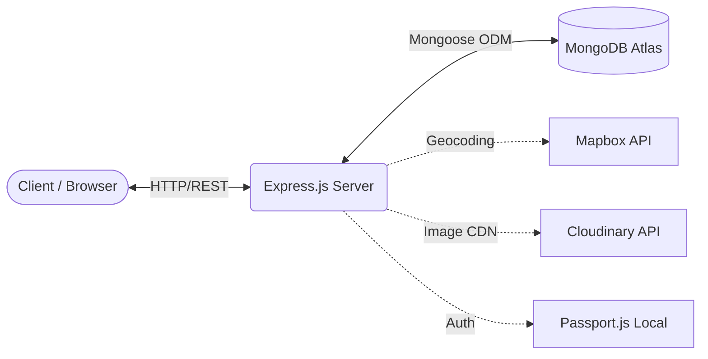

<h1 align="center">Stayria 🏖️</h1>

<p align="center">
  
  
  
  
  
</p>

> **Stayria** is a scalable, full-stack property booking platform engineered with Node.js and MongoDB. It features secure session-based authentication, interactive geospatial mapping, dynamic image processing, and a professional host analytics dashboard.

<div align="center">
  <i><!-- TODO: Insert a high-quality GIF or screenshot of your application here --></i>
  <br>
  <br>
  <a href="https://stayria.onrender.com"><strong>View Live Demo</strong></a> | 
  <a href="#getting-started"><strong>Explore the Docs</strong></a>
</div>

---

## 🏗️ System Architecture

Stayria follows a robust MVC (Model-View-Controller) architecture designed for scalability and maintainability.



## 🚀 Key Technical Achievements

MNCs require code that is not just functional, but secure, scalable, and beautifully designed. Here is how Stayria delivers:

- **Robust Security & Authentication**: Implemented secure, session-based authentication using `passport-local-mongoose`. Sessions are stored persistently in MongoDB using `connect-mongo` to survive server restarts, preventing session hijacking. Passwords are cryptographically salted and hashed.
- **Data Integrity & Validation**: Built rigid server-side validation schemas using `Joi` to sanitize all incoming payload data before it reaches Mongoose, effectively mitigating NoSQL injection and malformed data crashes.
- **Geospatial Engineering**: Integrated Mapbox API for forward geocoding. User-submitted string addresses are converted into GeoJSON coordinate data (`[longitude, latitude]`) on the backend and injected into the frontend for interactive, dynamic map rendering.
- **Dynamic File Processing**: Engineered a middleware pipeline using `Multer` and `Cloudinary` to parse `multipart/form-data`, stream image uploads directly to a CDN, and store optimized image URLs in the database.
- **Complex Relational Data**: Designed a complex MongoDB schema structure involving one-to-many and many-to-many relationships (Users ↔ Listings ↔ Reviews ↔ Bookings) using `populate()` for efficient document referencing.
- **Advanced UI/UX Engineering**: Crafted a modern, Airbnb-inspired interface using custom CSS and Bootstrap grids. Built a complex, interactive booking layout with sticky checkout cards, dynamic price calculations (taxes, fees, stay duration), professional flash alerts, and a mock payment gateway that triggers WhatsApp notifications.
- **Host Analytics Dashboard**: Engineered a data aggregation system for hosts that calculates total earnings, pending payouts, and automatically sorts relational guest bookings into 'Upcoming' and 'Past' lists based on JavaScript `Date` object comparisons.

---

## 🛠️ Tech Stack

### Frontend Layer
- **HTML5 / CSS3 / JavaScript (ES6+)**
- **EJS (Embedded JavaScript)** with `ejs-mate` for dynamic templating and layout management
- **Bootstrap 5** for responsive, mobile-first flexbox/grid layouts

### Backend Layer
- **Node.js** (Runtime environment)
- **Express.js** (Web framework and RESTful API routing)
- **Passport.js** (Authentication middleware)
- **Joi** (Data validation schema)
- **Multer** (File upload parsing)

### Database Layer
- **MongoDB Atlas** (Cloud NoSQL Database)
- **Mongoose** (Object Data Modeling)
- **connect-mongo** (Session store)

### APIs & DevOps
- **Cloudinary** (Image CDN and transformation)
- **Mapbox** (Geocoding and interactive mapping)
- **Render** (Cloud deployment and hosting)

---

## 💻 Getting Started (Local Development)

To run this project locally, follow these steps:

### 1. Clone the repository
```bash
git clone https://github.com/sanskritig007/stayria.git
cd stayria
```

### 2. Install dependencies
```bash
npm install
```

### 3. Configure Environment Variables
Create a `.env` file in the root directory and add your secret keys:
```env
ATLASDB_URL=your_mongodb_connection_string
SECRET=your_highly_secure_session_secret
CLOUD_NAME=your_cloudinary_cloud_name
CLOUD_API_KEY=your_cloudinary_api_key
CLOUD_API_SECRET=your_cloudinary_api_secret
MAP_TOKEN=your_mapbox_token
PORT=8080
```

### 4. Run the application
```bash
node app.js
```
The server will start on `http://localhost:8080`. Navigate to `/listings` to view the application.

---

## 🛤️ Future Roadmap

- [ ] **OAuth Integration**: Implement Google/GitHub sign-in using Passport strategies.
- [ ] **Payment Gateway**: Migrate the mock checkout flow to the live Stripe API.
- [ ] **WebSockets**: Introduce Socket.io for real-time messaging between hosts and guests.
- [ ] **Availability Engine**: Prevent double-booking by checking date overlap logic during checkout.

---
*This project is under active development.*
